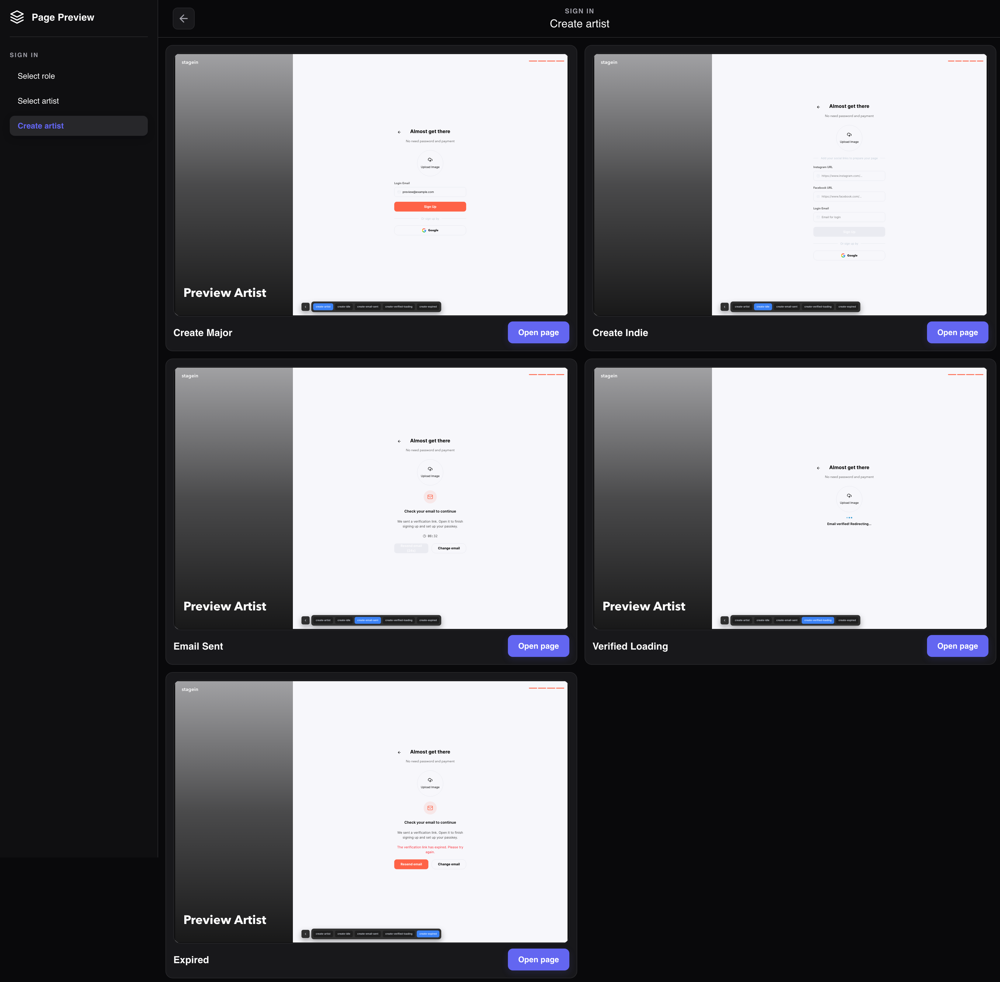
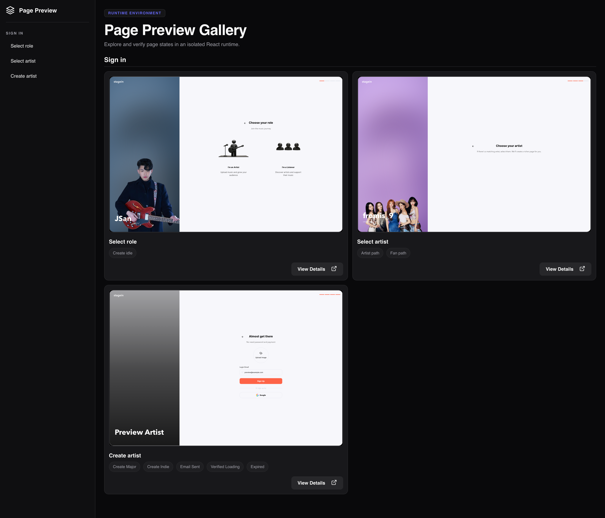
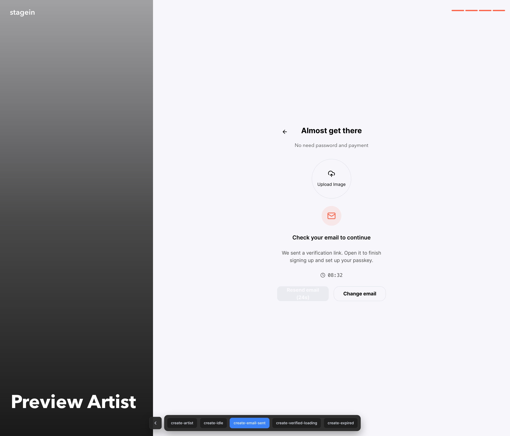

# page-preview

Storybook-like **page runtime preview** for full pages and hidden UI branches.






## Why

Component story tools are great for isolated UI, but they do not always cover real page branching (auth gates, async states, seeded stores, deep paths). `page-preview` runs a dedicated preview runtime on `:4100` and lets you define page variants as stories.

## Install

```bash
pnpm add -D page-preview
```

## Zero-config discovery (`*.preview.ts`)

By default, `page-preview` scans your project root and automatically merges every `*.preview.ts` file.

This means in app projects you can keep only one script:

```json
{
  "scripts": {
    "page-preview": "pnpm exec page-preview dev"
  }
}
```

Then run:

```bash
pnpm page-preview
```

## Story file format

```ts
import type { PagePreviewEntry } from "page-preview/lib";

export const pagePreviewStories: PagePreviewEntry[] = [
  {
    id: "create-artist",
    group: "Sign in",
    name: "Create artist",
    title: "Create artist",
    description: "Artist onboarding states",
    target: {
      path: "/sign-up",
      variantQueryKey: "preview",
      stateQueryKey: "__pp",
    },
    variants: [
      {
        id: "create-artist",
        label: "Artist selected",
        state: {
          zustand: [{ storeId: "signup", state: { step: "instagram" } }],
          reactQuery: [{ queryKey: ["seed"], data: { ok: true } }],
        },
      },
      { id: "create-idle", label: "Idle" },
    ],
  },
];
```

## State plugin injection (Zustand / Redux / Context / React Query)

Use `createPreviewBridge` from the library and register your state containers.

### Core rule: register once per container

- Register each target store/client **once** during app startup.
- You do **not** need to register on every page or every variant.
- Register only containers you want to control from preview states.

### Core rule: `storeId` must match

If your variant contains:

```ts
zustand: [{ storeId: "signup", state: { step: "role" } }];
```

You must register a Zustand store with the same id:

```ts
previewBridge.registerZustandStore("signup", useSignUpStore);
```

If ids do not match, that state block is ignored.

### 1) Create bridge instance

```ts
import { createPreviewBridge } from "page-preview/lib";

export const previewBridge = createPreviewBridge({
  queryKey: "__pp", // default
  developmentOnly: true, // default
});
```

### 2) Register stores/clients

```ts
import { queryClient } from "@/lib/gql/query-client";
import { useSignUpStore } from "@/screens/auth/sign-up/sign-up-store";
import { previewBridge } from "./preview-bridge";

previewBridge.registerZustandStore("signup", useSignUpStore);
previewBridge.registerReactQueryClient("app", queryClient);

// Optional providers:
// previewBridge.registerReduxStore("app", reduxStore);
// previewBridge.registerContextSetter("my-context", setContextValue);
```

Recommended place: a single module such as `src/dev/register-preview-project-adapters.ts` that is imported once from app bootstrap.

### 3) Apply snapshot from URL query once on app startup

```ts
import { previewBridge } from "@/dev/preview-bridge";

if (typeof window !== "undefined") {
  previewBridge.applyFromSearch(window.location.search);
}
```

### 4) Emit state from stories

`state` in each variant supports:

- `zustand: [{ storeId, state }]`
- `redux: [{ storeId, action }]`
- `context: [{ contextId, value }]`
- `reactQuery: [{ queryKey, data }]`

### Container mapping summary

- Zustand: `registerZustandStore("<id>", store)` ⇄ `state.zustand[].storeId`
- Redux: `registerReduxStore("<id>", store)` ⇄ `state.redux[].storeId`
- Context: `registerContextSetter("<id>", setter)` ⇄ `state.context[].contextId`
- React Query: any registered query client receives `state.reactQuery[]` via `setQueryData`

### Minimal wiring checklist

1. Create one bridge instance.
2. Register preview-target stores/clients once.
3. Call `applyFromSearch(window.location.search)` once at app startup.
4. Use matching ids in `*.preview.ts`.

## Examples

See `examples`.
